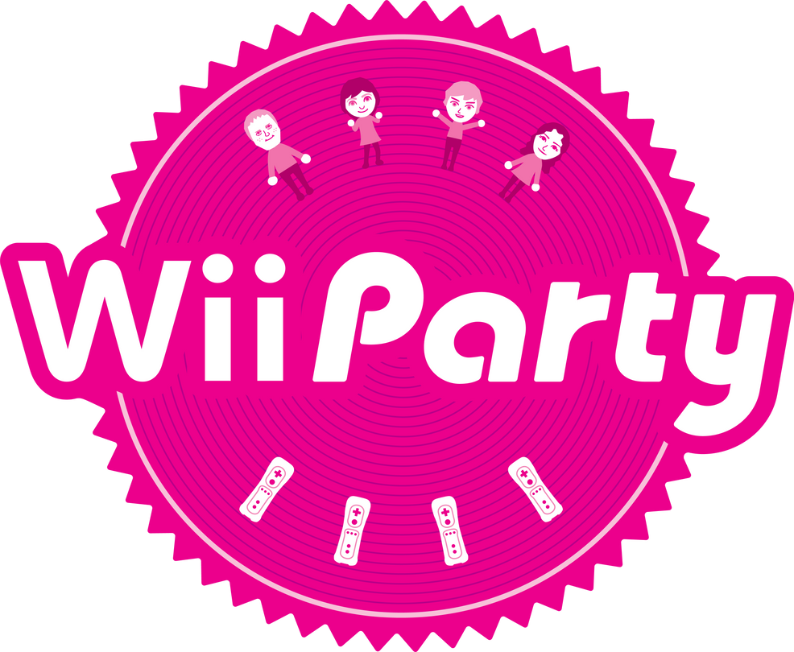

# Wii Party Patch

Play **Wii Party** (Wii) with a **Classic Controller** or **GameCube
controllers** instead of Wii Remotes. Works with the USA / Europe (`SUPE01`,
`SUPP01`), Japanese (`SUPJ01`, both revisions) and Korean (`SUPK01`) releases.

The patch is applied to your own copy of the game: drop a clean `.wbfs` or
`.iso` onto the patcher and play the result on a Wii (USB loader) or in
Dolphin. Nothing from the game is included in this repository.



## Features

- **Classic Controller**: left stick as D-pad / tilt, right stick as the
  pointer, ZL + ZR to shake
- **GameCube controllers**: ports 1-4 drive players 1-4 (includes the Classic
  Controller support, since the pad is presented to the game as one)

## Using it

Download the patcher for your platform from the
[releases](https://github.com/Wii-Patches/Wii-Party-Patch/releases), run it,
tick the patches you want and drop your disc image on the window. The patched
image replaces the original in place and the untouched original is kept
alongside as `<name>.bak`. Wiimms ISO Tool is bundled.

If you use a USB loader, turn its cheat / Gecko code handler off: the patch
lives in memory at `0x80001820`, next to where the handler sits.

## Building

The patcher reads prebuilt hook data from `tools/prebuilt/`; end users never
need a compiler. To regenerate it from `src/` you need devkitPPC and your own
`main.dol` dumps (see `tools/build.py`).

```
python3 tools/check.py          # consistency checks, no game files needed
python3 tools/gui.py            # run the patcher from source
```

## Status

Not yet tested on a real Wii.
